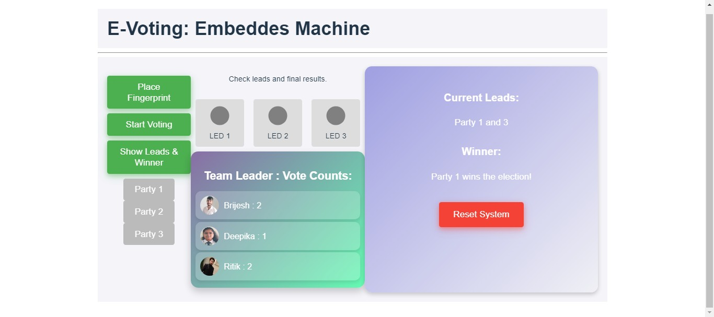

# Smart Fingerprint Enabled Voting Web Application

## Table of Contents

1. [Introduction](#introduction)  
2. [Features](#features)  
3. [Prerequisites](#prerequisites)  
4. [Setup and Installation](#setup-and-installation)  
5. [Usage](#usage)  
6. [Project Report](#project-report)  
7. [Contributing](#contributing)  
8. [License](#license)

---

## Introduction
This project is a secure web application for online voting, leveraging fingerprint authentication through compatible devices. It aims to modernize traditional voting systems by incorporating biometric technology to ensure voter authenticity, accessibility, and transparency.

---
## Demo




## Features
- **Biometric Authentication**: Enables secure fingerprint-based voter verification via supported hardware.  
- **Web-Based Platform**: Accessible via browsers on desktops, laptops, and mobile devices.  
- **Encrypted Data Communication**: Ensures voter information privacy and security using HTTPS and JWT.  
- **Real-Time Vote Tallying**: Provides instant, efficient, and accurate vote counting.  
- **Responsive Design**: A user-friendly interface adaptable to various screen sizes.  

---

## Prerequisites
- **Node.js** (v14 or later)  
- **React.js** for frontend development  
- **MongoDB** for database storage  
- **Fingerprint SDK/API** (optional, for advanced biometric integration)  
- **A modern browser** (e.g., Chrome, Firefox, Edge)

---

## Setup and Installation

1. **Clone the Repository**:  
   ```bash
   git clone https://github.com/your-username/smart-voting-webapp.git
   cd smart-voting-webapp
   ```

2. **Install Dependencies**:  
   ```bash
   npm install
   ```

3. **Setup Backend**:  
   - Navigate to the `backend` folder:  
     ```bash
     cd backend
     ```  
   - Install backend dependencies:  
     ```bash
     npm install
     ```  
   - Start the backend server:  
     ```bash
     node server.js
     ```  

4. **Run the Web Application**:  
   - Navigate back to the main project folder:  
     ```bash
     cd ..
     ```  
   - Start the React development server:  
     ```bash
     npm start
     ```  
   - Open `http://localhost:3000` in your browser to access the application.  

---

## Usage
1. **Register**: Sign up as a voter by providing required details and fingerprint authentication via a supported device.  
2. **Login**: Authenticate using your registered credentials and fingerprint.  
3. **Vote**: Select an election, review the options, and cast your vote securely.  
4. **Logout**: Ensure your session ends securely after completing your vote.  

---

## Project Report

### Dr. A.P.J. Abdul Kalam Technical University, Lucknow

### ACKNOWLEDGEMENT
We extend our heartfelt gratitude to Dr. A.P.J. Abdul Kalam Technical University, Lucknow, for providing the resources and support throughout this project. We also express our sincere thanks to our mentors, colleagues, and family members for their invaluable guidance and encouragement.  

### ABSTRACT
This web application focuses on addressing challenges in traditional voting systems by introducing fingerprint-enabled authentication for secure online voting. Using React.js for the frontend and a Node.js-MongoDB-based backend, this system ensures reliable voter identification, data encryption, and real-time vote tallying. The project also integrates advanced biometric technology for enhanced accuracy and trustworthiness, contributing to the integrity of democratic processes.  

### INDEX
- Chapter 1 Introduction  
  - 1.1 Introduction  
  - 1.2 Problem Statement  
  - 1.3 Identification of Need  
  - 1.4 Objective  
  - 1.5 Uniqueness of the innovation  
  - 1.6 Applications  
    - 1.6.1 Potential Areas of Application in Industry/Market (in Brief)  
    - 1.6.2 Market Potential of Idea/Innovation  
- Chapter 2 Literature Survey  
- Chapter 3 Problem Formulation and Proposed Work  
- Chapter 4 Feasibility Study  
- Chapter 5 Methodology  
- Chapter 6 Results and Discussion  
- Chapter 7 Conclusion  

---

## Contributing
Contributions are welcome! Follow these steps to contribute:  

1. Fork the repository.  
2. Create a feature branch:  
   ```bash
   git checkout -b feature-name
   ```  
3. Commit your changes:  
   ```bash
   git commit -m "Description of changes"
   ```  
4. Push to the branch:  
   ```bash
   git push origin feature-name
   ```  
5. Submit a pull request.  

---

## License
This project is licensed under the MIT License. See the `LICENSE` file for details.
